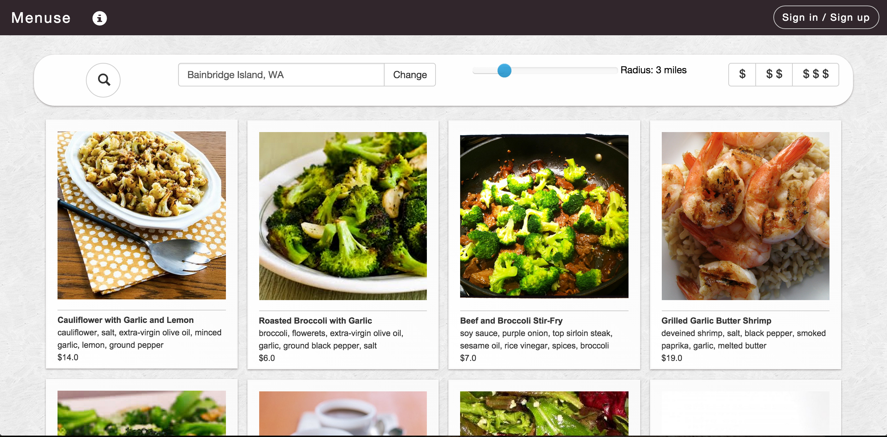
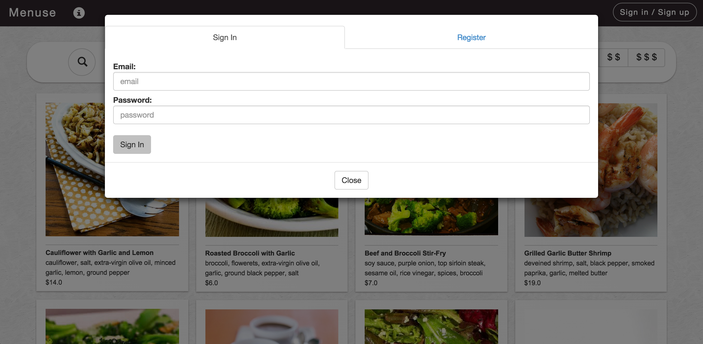
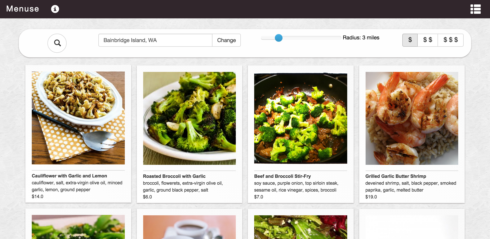
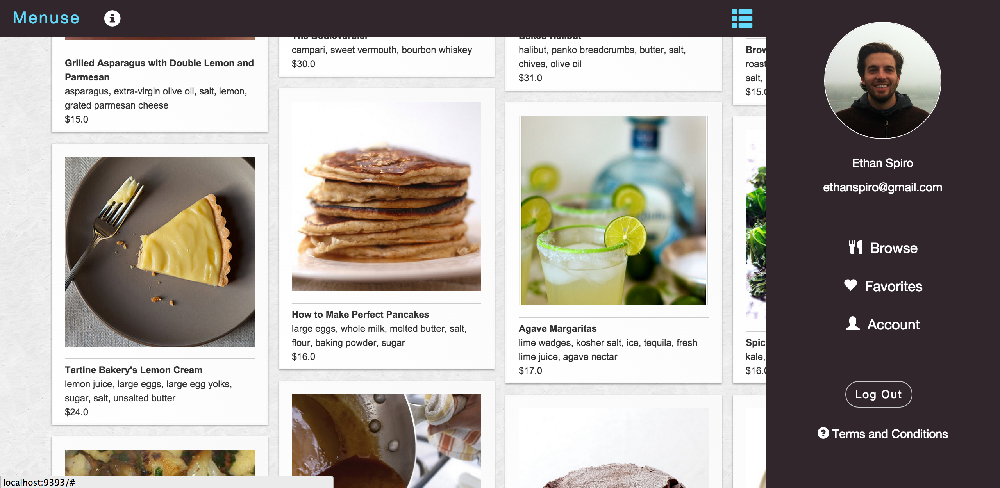

# Menu Muse

## Picture menu tool for restaurants and consumers

A web application that will be used by restaurants to upload pictures of their dishes and a mobile view that will be used by customers to see the food. Consumers have a hard time choosing foods when looking at a written menu, especially when the menu does not include pictures. With this said, most restaurants view picture menus as being expensive, cumbersome and ugly. For this reason, there is a significant conflict between consumers and restaurant owners when it comes to menu design. Consumers tend to make menu choices based on their perceived likeability of an item, but they make this choice without actually seeing the food. Hopefully this will solve that problem.

http://menuse.herokuapp.com - old version

Newer UI redesign (code not in this repo)

___

### Splash

___

### Log In

___

### Logged in

___

### User menu

___

Email for rest of code or more new designs